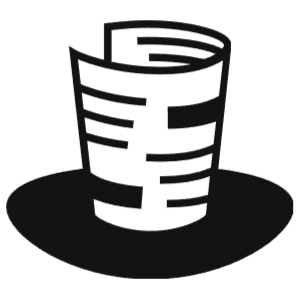
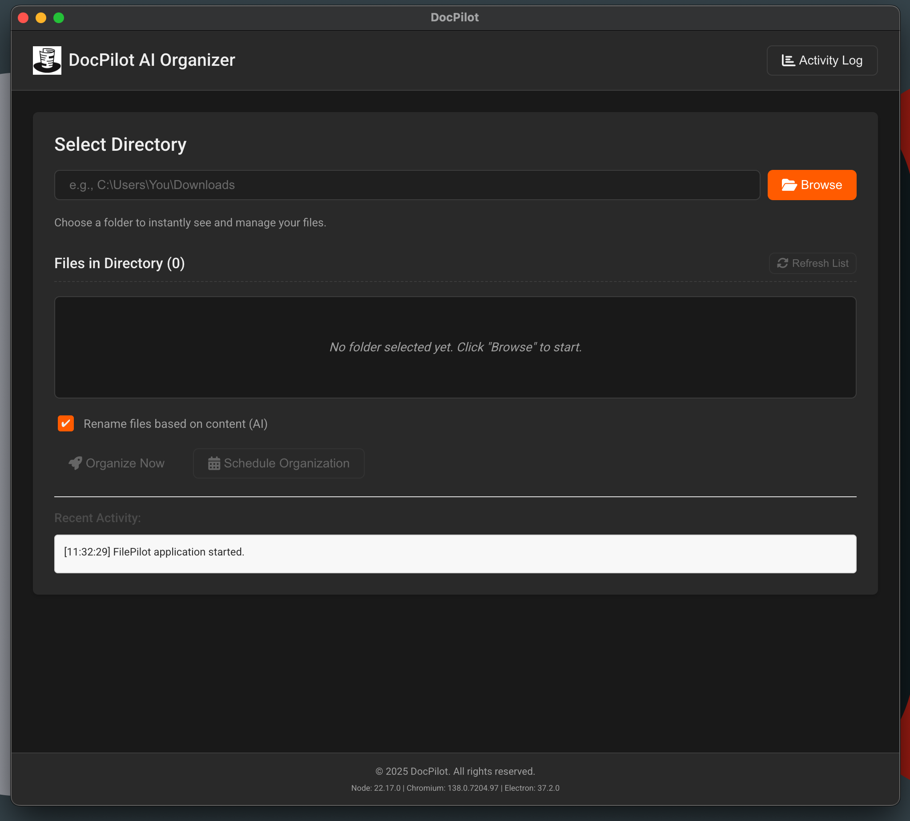

# DocPilot AI Organizer



 DocPilot AI Organizer is a powerful desktop application built with Electron, designed to revolutionize your file management. Leveraging the power of local Artificial Intelligence (Ollama), DocPilot intelligently analyzes your file content, categorizes it, and suggests descriptive new names, helping you maintain an organized and efficient digital workspace.

## ✨ Features

* **Intelligent File Categorization:** DocPilot uses a local AI model to read the content of your files and automatically categorize them into logical groups (e.g., Business, Code, Documents, Financial, Personal, etc.).
* **AI-Powered Renaming Suggestions:** Get smart, concise, and descriptive new file names based on the actual content, making it easier to find what you need later.
* **Offline Functionality:** Since all AI processing happens locally via Ollama, DocPilot operates entirely offline, ensuring privacy and speed.
* **Directory Management:** Easily select, monitor, and organize files within specified directories.
* **Scheduled Organization:** Set up recurring tasks to keep your folders tidy automatically.
* **Activity Log:** Track all organization actions, renames, and moves for full transparency.
* **Intuitive User Interface:** A clean, responsive Electron-based interface designed for ease of use.

## 🚀 Getting Started

To get DocPilot up and running, you'll need Node.js (for Electron) and Python (for the backend). You'll also need the Ollama server installed and a compatible AI model downloaded.

### Prerequisites

* **Node.js & npm:** [Download and install Node.js](https://nodejs.org/en/download/) (npm is included).
* **Python 3.8+:** [Download and install Python](https://www.python.org/downloads/).
* **Ollama Server:** [Download and install Ollama](https://ollama.com/download) for your operating system.
* **Ollama AI Model:** Once Ollama is installed, open your terminal/command prompt and pull a suitable model. We recommend `llama2` or `mistral` for general text analysis.
    ```bash
    ollama pull llama2 # Or ollama pull mistral
    ```
    Ensure the model name you pulled (e.g., `llama2`) matches the `OLLAMA_MODEL` in your `backend/config.py` file.

### Installation & Setup

1.  **Clone the repository:**
    ```bash
    git clone [https://github.com/your-username/DocPilot.git](https://github.com/your-username/DocPilot.git) # Replace with your repo URL
    cd DocPilot
    ```

2.  **Backend Setup (Python):**
    Navigate into the `backend` directory, set up a virtual environment, install dependencies, and build the executable.

    ```bash
    cd backend
    python -m venv venv
    # On Windows:
    .\venv\Scripts\activate
    # On macOS/Linux:
    source venv/bin/activate

    pip install -r requirements.txt # Ensure requirements.txt lists Flask, Ollama, etc.

    # Build the Python executable using PyInstaller
    # This creates the 'backend_dist' folder which Electron will bundle
    pyinstaller docpilot_backend.spec # Assumes you have docpilot_backend.spec created
    # If you don't have a spec file yet, run:
    # pyinstaller --name docpilot_backend --add-data "config.py:." --add-data "ollama_handler.py:." app.py
    # Then edit the generated docpilot_backend.spec for production settings (console=False, etc.)
    # and re-run pyinstaller docpilot_backend.spec
    ```
    After this step, you should have a `backend_dist` folder inside your `backend` directory, containing the `docpilot_backend` executable (or `docpilot_backend.exe` on Windows).

3.  **Frontend Setup (Electron):**
    Navigate back to the project root and install Node.js dependencies.

    ```bash
    cd .. # Go back to the DocPilot root directory
    npm install
    ```

### Running in Development Mode

To run the application in development, both the Electron app and the Python backend need to be started. The `main.js` will attempt to launch the PyInstaller-built backend executable from `backend_dist`.

```bash
npm start
